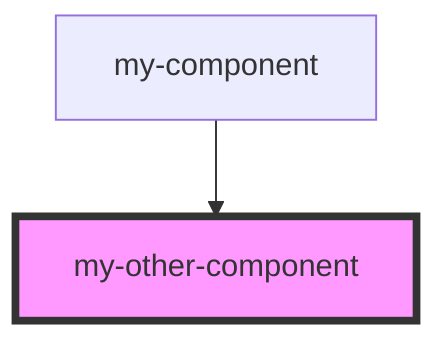

# my-other-component

<!-- Auto Generated Below -->

## Methods

### `foo() => Promise<void>`

#### Returns

Type: `Promise<void>`

## Dependencies

### Used by

 - [my-component](../my-component)

### Graph

----------------------------------------------

*Built with [StencilJS](https://stenciljs.com/)*
